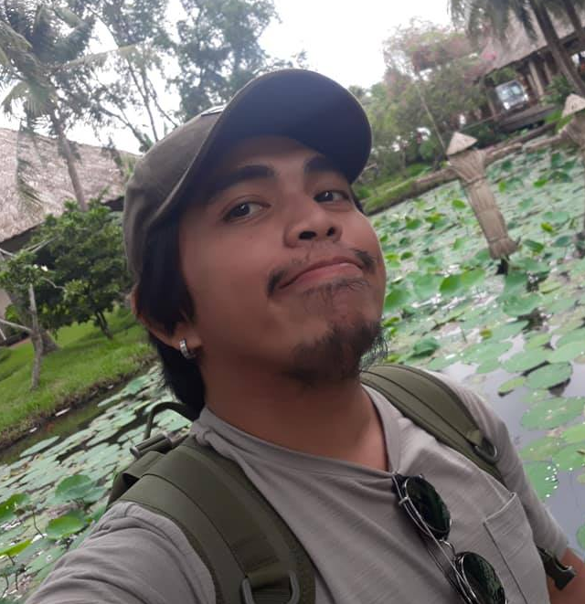
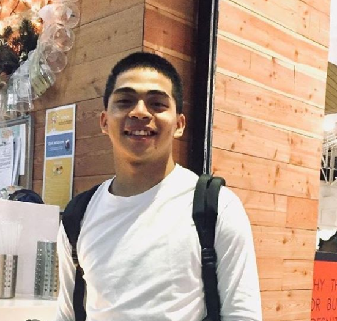
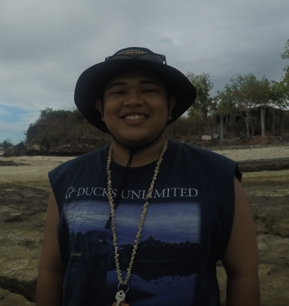

Trusted Project

Is a side project by Neil, Kean, and Jeb Hermosilla. These projects aim to help ourselves be better in the realms of programming and software engineering while making the knowledge available to everyone.

 
 

### Core Values

- Curiosity - One has to have the desire to ask why or why not. Knowledge doesn't start from teaching oneself but questioning what is being taught.
- Passion - One has to have the drive to manuever hardships and still find joy in what he is doing.
- Challenging - One has to have a mindset of challenging the status quo.
- Relentless - One has to have the character to push through what needs to be done.
- Audacity - One has to have the commitment to never settle for less.
- Simple - One has to have the foundation to simplify the thought.

 
 

### Core Team

  